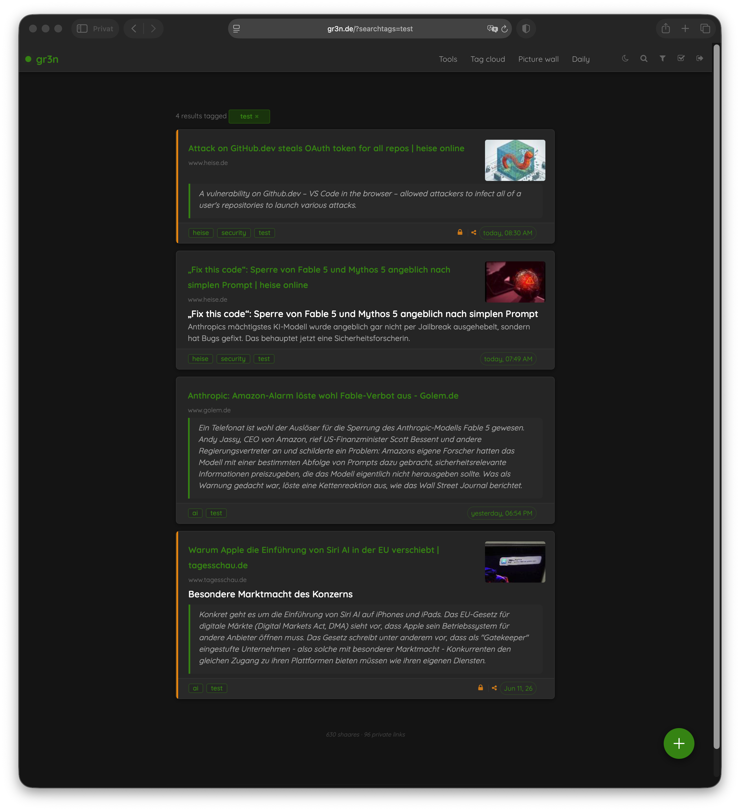
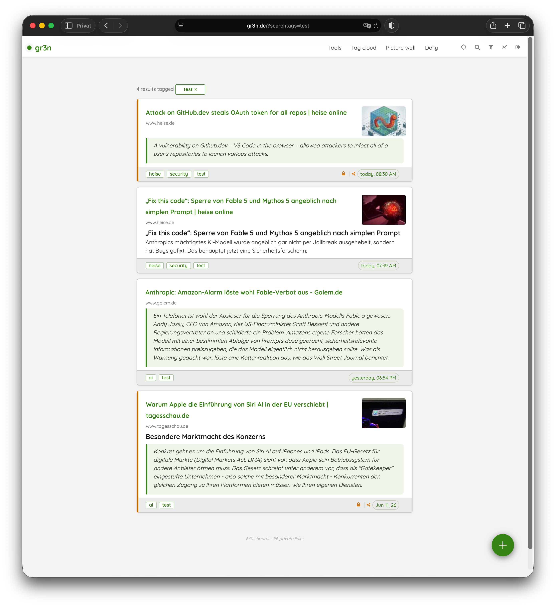
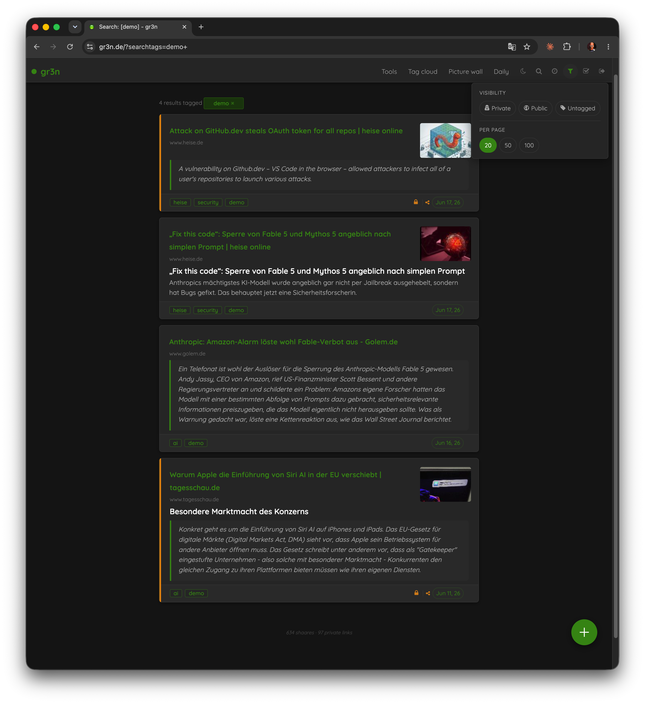

# origr3n

[](CHANGELOG.md)
[](LICENSE)
[](https://github.com/shaarli/Shaarli)

A clean, opinionated [Shaarli](https://github.com/shaarli/Shaarli) theme built on the **gr3n design language** — Deep Forest green, Quicksand typeface, dark/light toggle.

> Compatible with Shaarli v0.16.3+  
> Status: **v1.1.1** — live at [gr3n.de](https://gr3n.de)

---

## Feature Showcase

Not sure what Shaarli can do — or why origr3n makes it better?

**[→ Full Feature Showcase (EN)](https://gruenheit.github.io/origr3n/)** — 12 core features, 11 origr3n enhancements, 7 use cases, comparison table and quick-start guide.  
**[→ Feature-Showcase (DE)](https://gruenheit.github.io/origr3n/shaarli-showcase-de.html)** — Deutschsprachige Version.

---

## Screenshots

| Dark Mode | Light Mode |
|-----------|------------|
|  |  |

| Filter Panel (Visibility + Per Page) |
|--------------------------------------|
|  |

---

## Features

### Linklist (main view)

- **Card design:** 3px green accent border left; private links amber (hover border + stripe); domain line below title
- **Title truncation:** 3-line clamp with tooltip on hover (mobile-safe)
- **Decorative highlight:** click card body toggles `.selected` (green outline), multiple cards at once; click outside clears all
- **Select mode:** header icon activates `body.select-mode` — click cards to select + tick native Shaarli checkboxes; bottom bar with count, select-all, delete/public/private/cancel actions
- **Badges:** Private label (amber) + Sticky badge (`fa-bookmark`, green) in `.linklist-item-editbuttons`
- **Footer band:** tags + date pill + icons; click expands/collapses; layout-stable (visibility, no reflow)
- **Footer icons:** green scale — edit `#3d8e12`, delete `#5a7a4a`, pin/bookmark `#3d8e12`
- **Visibility toggle:** fa-lock (amber) / fa-unlock-alt — toggles private ↔ public
- **Private share link:** amber `#d4851a` (fa-share-alt)
- **Timeline toggle:** clock icon in the header activates day-separator dividers between link cards; state persists in localStorage
- **Date pill = permalink:** click opens `shaare/{shorturl}`; relative format ("today, 14:32" / "yesterday" / "11 Jun 26")
- **Tag pills:** green border, hover inversion; no redundant tag icon

### Header

- **FAB "+ Share":** fixed green circle (56×56px) bottom right
- **Nav links:** `--text-secondary` default, `--color-primary` on hover
- **Header icons:** round hover surface; moon, search, filter, select-toggle, logout/login; uniform `var(--text-muted)` → `--color-primary` on hover
- **Filter panel:** visibility and results-per-page pills; position fixed
- **Search overlay:** full-screen backdrop, Awesomplete autocomplete; press `/` anywhere to open (standard shortcut: GitHub, YouTube, Reddit), `Escape` to close

### Other pages

- **Tag cloud:** JS color gradient — frequent tags lighter, rare tags darker
- **Tag list:** green count badges
- **Tools:** accent line left, menu rows with `→` arrow; all three panels uniform `1/2` width
- **Settings pages (cfg-* layout):** configure, changepassword, changetag, export, import, pluginsadmin, server — consistent single-column card format with toggle switches
- **Add/Edit form:** micro-caps labels, full-width inputs, ghost-red delete, styled Markdown toolbar, Bootstrap-Markdown fullscreen support
- **PRIVATE stripe:** sidebar stripe switches live to amber via CSS `:has()`, no JS
- **URL + title tooltip:** full content as browser tooltip, updates on input

### Markdown

- Blockquote: green left border, tinted background, italic
- Code blocks: dark background, green inline code
- Lists: proper indent (Pure CSS reset corrected)
- Editor preview (`.md-preview`): same dark/light theme as rendered output

---

## Recommended plugins

origr3n is styled and tested with these plugins:

| Plugin | Source | Purpose |
|--------|--------|---------|
| **markdown** | [built into Shaarli](https://github.com/shaarli/Shaarli/tree/master/plugins/markdown) | Renders descriptions as Markdown/MarkdownExtra — enables blockquote styling, code blocks, lists |
| **markdown_toolbar** | [immanuelfodor/shaarli-markdown-toolbar](https://github.com/immanuelfodor/shaarli-markdown-toolbar) | Adds a Bootstrap Markdown toolbar + fullscreen editor to the description field |

Enable both in **Tools → Plugin administration**. Install `markdown_toolbar` by downloading the release and placing it in your Shaarli `plugins/` directory.

---

## Internationalization

origr3n follows the language configured in Shaarli (the `<html lang="...">` attribute):

- **Templates** use Shaarli's built-in `t()` function — strings like *Private*, *Make public* follow the instance language automatically
- **JS strings** (select bar, date pill, tag cloud labels, filter panel labels) read `document.documentElement.lang` at runtime — German and English are built in; other languages fall back to English

No configuration needed: set your Shaarli language in `config.json` (`general.language`) and the theme follows.

---

## Installation

### Quick install

1. Clone or download this repository
2. Copy `origr3n/` into your Shaarli `tpl/` directory:
   ```bash
   cp -r origr3n/ /path/to/shaarli/tpl/
   ```
3. In Shaarli: **Tools → Change theme → origr3n**

### Docker

```bash
rsync -av origr3n/ dockerhost:/srv/docker/shaarli/tpl/origr3n/
```

Then select the theme in Shaarli settings.

---

## Font

origr3n bundles [Quicksand](https://fonts.google.com/specimen/Quicksand) (latin + latin-ext subsets) in `origr3n/fonts/`. Quicksand is licensed under [SIL Open Font License 1.1](origr3n/fonts/OFL.txt) by Andrew Paglinawan — redistribution is permitted.

No external font requests.

---

## Development

```
Shaarli-origr3n/
├── origr3n/
│   ├── css/origr3n.css      — main stylesheet (token system, all pages)
│   ├── fonts/               — Quicksand woff2 subsets + OFL.txt
│   ├── js/origr3n.js        — dark/light toggle, search overlay, select mode, filter panel
│   ├── includes.html        — head: CSS link (with ?r=N cache busting), JS snippets
│   ├── linklist.html        — main view
│   └── ...                  — further templates
├── _design/                 — comparison pages, prototypes (not deployed)
├── CHANGELOG.md
└── README.md
```

**Deploy:**
```bash
rsync -av origr3n/ user@host:/path/to/shaarli/tpl/origr3n/
```

Cache busting: increment `r=N` in `includes.html` on CSS changes.

---

## License

MIT — see [LICENSE](LICENSE)

Font: Quicksand — SIL Open Font License 1.1 (see `origr3n/fonts/OFL.txt`)
